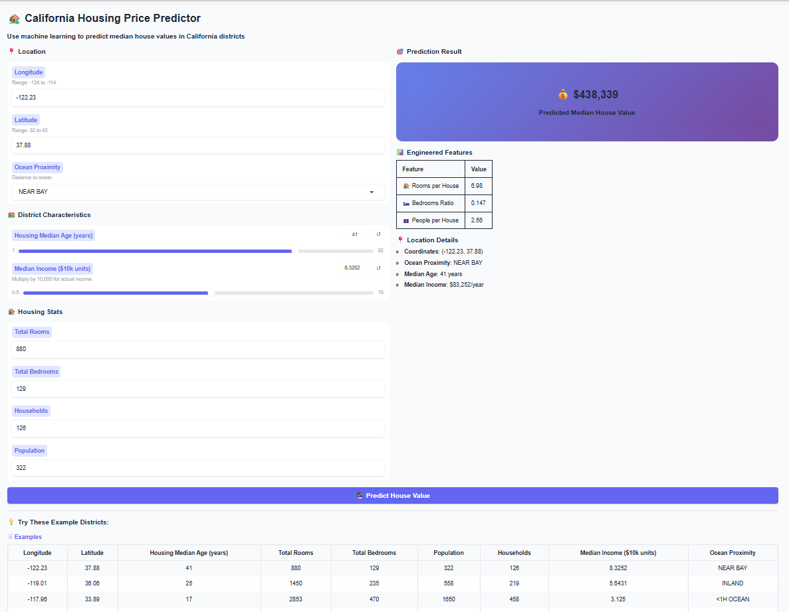
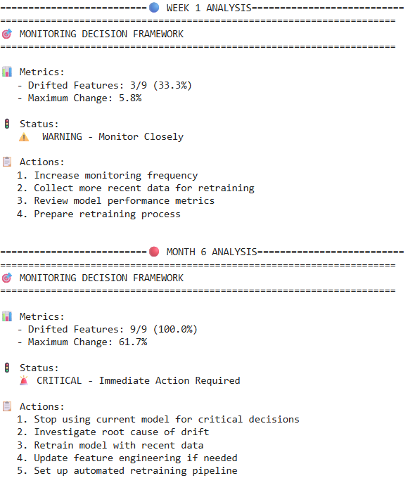

## 🏠 California Housing Price Prediction

**A complete Machine Learning pipeline project for educational purposes**

This repository was created to support **Machine Learning training for PowerCoders Switzerland**.

Based on a case study from Hands-On Machine Learning with Scikit-Learn, Keras, and TensorFlow by Aurélien Géron.

---

## 📋 Project Overview

**Goal:** Predict median house values in California districts using machine learning regression models.

**Dataset:** California Housing Dataset (1990 census data) - 20,640 observations, 9 features.

**Methods:** This project demonstrates the complete ML lifecycle including data preprocessing, feature engineering, model training, deployment, and monitoring. It employs several regression models including Linear Regression, Decision Tree Regressor, and Random Forest Regressor, along with comprehensive data preprocessing techniques such as imputation, outlier handling, categorical encoding, and feature scaling.

---

## 📁 Project Structure

california-housing-prediction/

├── notebooks/          # Jupyter notebooks

│   ├── housing_analysis.ipynb       # Main analysis & training

│   ├── deployment_gradio.ipynb      # Model deployment

│   └── monitoring_basic.ipynb       # Drift detection

├── dataset/           # Data files

├── images /           # snippets from Interactive tool and Monitoring message 

└── README.md

---

## 🔍 Analysis Steps

- [x] 1. Data Loading & Exploration
    *   The project loads data from a `.tgz` file, inspects its structure using `.head()`, `.info()`, and `.describe()`, and visualizes distributions with histograms.
- [x] 2. Data Cleaning & Preprocessing
    *   This step involves handling missing values using `SimpleImputer` with a median strategy, identifying potential outliers with `IsolationForest`, encoding categorical features using `OneHotEncoder`, and applying feature scaling with `MinMaxScaler` and `StandardScaler`. Log transformation for skewed distributions and discretization of `median_income` are also performed.
- [x] 3. Feature Engineering
    *   New, more predictive features are created, including "rooms_per_house", "bedrooms_ratio", and "people_per_house", to capture meaningful patterns from the raw data.
- [x] 4. Model Training
    *   The data is split into 80% training and 20% testing sets. Three regression models—Linear Regression, Decision Tree Regressor, and Random Forest Regressor—are trained using a preprocessing pipeline.
- [x] 5. Model Evaluation
    *   Models are evaluated using Root Mean Squared Error (RMSE) on both the training and test sets to assess performance and generalization.
- [x] 6. Results & Insights

---

## 📊 Results

The models were evaluated based on their Root Mean Squared Error (RMSE) on the test set:

*   **Linear Regression:**
    *   Training RMSE: 67,884.31
    *   Test RMSE: 68,649.38
    *   The Linear Regression model provided a reasonable baseline with good generalization, as the test RMSE was close to the training RMSE. However, the absolute error was still quite high.
*   **Decision Tree Regressor:**
    *   Training RMSE: 0.0
    *   The Decision Tree perfectly fit the training data, resulting in an RMSE of 0.0, which is a classic sign of overfitting. This model is highly likely to perform poorly on unseen data.
*   **Random Forest Regressor:**
    *   Training RMSE: 18,327.91
    *   Test RMSE: 18,663.56
    *   The Random Forest model demonstrated superior performance. Its test RMSE (18,663.56) was very close to its training RMSE, indicating excellent generalization. This RMSE is significantly lower than that of the Linear Regression model, confirming Random Forest as a powerful model for this dataset.

**Conclusion:** The Random Forest Regressor emerged as the best-performing model, offering a strong balance between predictive accuracy and generalization capabilities.

---
🚀 **Deployment**

The trained Random Forest model was deployed using **Gradio**, creating an interactive web interface for real-time predictions.

**Gradio Interface:**

**Features**:
🌐 Public Web Interface - Accessible via shareable Gradio link
🤖 Real-time Predictions - Instant housing price estimates
📊 Interactive Sliders - Easy input for all 9 features 
💾 Models Versioning - Stored on Hugging Face Hub for reproducibility
📱 Mobile-Friendly - Works on any device with a browser
 
**Try It Out**: notebooks/gradio_deployment.ipynb 

**Deployment Architecture**:
1. Model Export: Trained model saved as housing_model.pkl
2. Model Storage: Uploaded to Hugging Face Hub for versioning
3. API Creation: Gradio interface with 9 input features
4. Public Access: Generated shareable link (72-hour validity)

Example Usage: Input features like median income, house age, and location coordinates to receive instant price predictions with confidence intervals.

---
📈 **Model Monitoring**:

Implemented data **drift detection** to ensure model reliability in production. Monitoring helps identify when the model needs retraining due to changes in input data distribution.

**Drift detection dashboard**

**Monitoring Approach**:
1. Statistical Testing: Kolmogorov-Smirnov (KS) test for distribution comparison
2. Visualization: Side-by-side histograms comparing training vs. production data
3. Decision Framework: Automated alerts for drift severity levels

**What We Monitor**:
1. Data Drift: Changes in feature distributions
2. Feature Statistics: Mean, median, standard deviation shifts
3. Drift Severity: Percentage of features showing significant drift

---

## 🛠️ Technologies Used

**Core Libraries**:
  - Python 3.7+
  - Pandas, NumPy: Data analysis and numerical operations
  - Scikit-learn 1.0.1+: Machine learning models, preprocessing and evaluation
  - Matplotlib, Seaborn: Data visualization

**Deployment & Monitoring**:
  - Gradio: Interactive web interface for model deployment
  - Hugging Face Hub: Model versioning and storage
  - SciPy: Statistical testing for drift detection

**Development Environment**:
  - Google Colab: Cloud-based Jupyter notebook environment
  - GitHub: Version control and collaboration

**Additional Tools**:
pathlib, tarfile, urllib.request: File operations and data downloading
packaging: Version parsing

---
🎓 **Learning Outcomes**

This project demonstrates key machine learning concepts:

Data Preprocessing Pipeline - Handling real-world messy data
Feature Engineering - Creating meaningful predictors
Model Comparison - Evaluating multiple algorithms
Deployment - Taking models from notebook to production
Monitoring - Ensuring long-term model reliability
MLOps Basics - Complete ML lifecycle management

---
